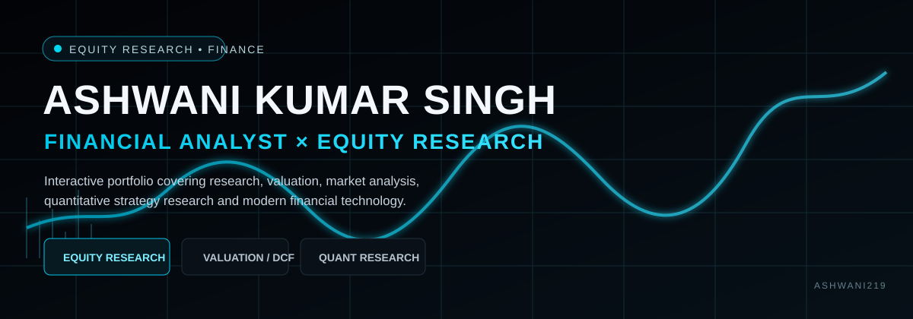

# Ashwani Kumar Singh — Finance & Research Portfolio

<p align="center">
  <a href="https://ashwani-portfolio-omega.vercel.app/">
    
  </a>
</p>

<p align="center">
  <a href="https://ashwani-portfolio-omega.vercel.app/"><strong>🌐 Live Portfolio</strong></a>
  &nbsp;•&nbsp;
  <a href="https://github.com/Ashwani219"><strong>GitHub Profile</strong></a>
</p>

> **Equity Research • Financial Analysis • Quantitative Trading • FinTech**

A personal portfolio built with **Next.js + TypeScript** to showcase equity research, valuation work, quantitative strategy research, financial-market analysis, and technology projects.

## 📊 What You'll Find Here

### Equity Research
- Company and business analysis
- Financial statement review
- Valuation and DCF analysis
- Peer comparison
- Technical analysis
- Investment thesis presentation

### Quantitative & Trading Research
- Strategy research and experimentation
- Backtesting workflows
- Performance analysis
- Equity and drawdown curves
- Trading signal visualization

### Interactive Research Tools
- Financial charts
- Interactive DCF model
- Research terminal interface
- Strategy lab
- Research workflow / process views

## 🔎 Featured Research

### Zaggle Equity Research
An interactive equity-research experience covering company fundamentals, valuation, peer analysis, technical analysis, and investment thesis development.

### SATS Dynamic Swing Backtester
A research-oriented Python backtesting project focused on systematic trading strategy evaluation and performance analysis.

## 🛠️ Technology Stack

**Frontend**  
Next.js • React • TypeScript • Tailwind CSS

**Research & Analytics**  
Python • Financial Analysis • Quantitative Research • Data Visualization

**Development**  
Git • GitHub • VS Code

## 📁 Project Structure

```text
app/            # Next.js application routes and pages
components/     # Reusable UI and research components
data/           # Portfolio / research data
public/         # Images, charts, and static assets
docs/           # Repository documentation and visual assets
```

## ✨ Key Portfolio Sections

- Market Snapshot
- Featured Equity Research
- Quantitative Strategy Lab
- Institutional Research Process
- About / Skills / Certifications
- Resume Viewer
- Contact Section

## 🎯 Purpose

This portfolio is designed to combine **finance and technology** into a practical research workspace — demonstrating how financial analysis, valuation, quantitative methods, and modern web development can work together.

## 🚀 Run Locally

```bash
npm install
npm run dev
```

Then open:

```text
http://localhost:3000
```

## ⚠️ Disclaimer

The research, analysis, examples, charts, and opinions presented in this project are for **educational and informational purposes only** and should not be considered investment advice or a recommendation to buy or sell any security.

## 📌 Roadmap

- [x] Portfolio website
- [x] Interactive research sections
- [x] Valuation / DCF interface
- [x] Trading strategy research interface
- [x] Live production deployment
- [x] GitHub project presentation
- [ ] Additional equity research reports
- [ ] Additional certificates and research projects

## 👋 About

**Ashwani Kumar Singh**

Finance & Technology enthusiast focused on equity research, financial markets, quantitative trading research, and FinTech.

---

⭐ Built to present research and projects in a clear, analytical, and professional format.
